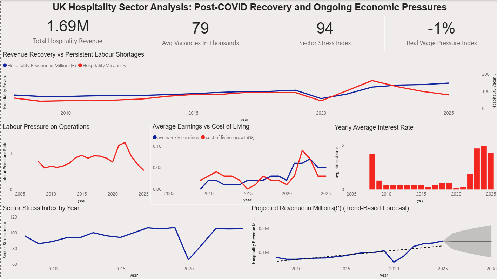

# UK Hospitality Sector Analysis & Forecast

## Project Overview

This project is an end-to-end data analysis of the UK hospitality sector, combining macroeconomic indicators with industry data to understand performance trends and forecast future revenue.

The workflow covers:
- Data cleaning (Excel)
- Data modelling & transformation (SQL)
- Exploratory analysis (SQL)
- Dashboarding (Power BI)
- Forecasting & storytelling (Tableau)

## Objectives

- Analyse how macroeconomic factors impact hospitality performance  
- Understand labour shortages and cost pressures  
- Build derived indicators to measure sector stress  
- Forecast future revenue trends

## 1, Raw Data Collection

Datasets used:

- Consumer spending (HFCE)
- Cost of living index
- Average Weekly Earnings (AWE)
- Interest rates
- Hospitality vacancies
- Hospitality revenue (Accommodation + Food & Beverage)

### Initial Data Issues

- Inconsistent formats (CSV / Excel)
- Metadata rows and headers
- Currency encoding issues (e.g. "£")
- Percentages stored as text (e.g. "5.2%")
- Missing values
- Misaligned time ranges
- 
## 2, Data Cleaning (Excel)

### Key Transformations

**1. Standardising Column Names**
- Renamed variables for clarity (e.g. `HFCE` → `consumer_spending_m`)

**2. Removing Metadata**
- Deleted titles, notes, and non-tabular rows

**3. Fixing Data Types**
- Converted percentage strings to numeric values
- Removed currency symbols and encoding issues
- Ensured all numeric columns were properly formatted

**4. Time Alignment**
- Standardised `year` column across all datasets
- Ensured consistent time coverage

### Output

Clean, structured CSV files ready for SQL ingestion

## 3, Database Setup (MySQL)

Each dataset was initially stored in its own SQL table before integration into a master dataset.

## Why Separate Tables?
- Improves organisation and readability
- Easier debugging and validation
- Reflects real-world data architecture
- Prevents duplication of data
- Allows independent updates to each dataset

Using separate tables also made it easier to validate the quality of each dataset before combining them into a single analytical model.

## 4, Loading Data into SQL

After cleaning the datasets in Excel, all files were imported into MySQL as CSV files.

### Key Actions

- Imported cleaned CSV datasets into MySQL
- Ensured correct column data types
- Standardised numeric formatting
- Validated imported row counts against source files

### Challenges Solved

- Header rows interfering with imports
- Percentage values stored as text
- Currency formatting inconsistencies
- Missing or null values

### Outcome

All datasets were successfully loaded into SQL and structured for relational analysis.

## 5, Data Integration (Joins)

Once the individual tables were created, they were integrated into a unified master dataset using SQL joins.

### Why Joins Were Necessary

The datasets contained different economic and operational indicators across the same timeline. Joining them created a single analytical view that could be used for:
- trend analysis
- forecasting
- dashboarding
- KPI calculations

### Join Strategy

`LEFT JOIN` was used throughout the project.

### Why LEFT JOIN ?

- Preserves all years from the main dataset
- Prevents accidental data loss
- Allows incomplete datasets to still contribute useful information
- Maintains continuity for time-series analysis

This approach ensured the final dataset remained stable even if some datasets had missing years or incomplete records.

### Outcome

A complete master dataset containing:
- revenue
- labour data
- wages
- inflation
- spending
- interest rates

All combined into a single masted dataset.

## 6, Feature Engineering

Additional analytical variables were created directly in SQL to transform raw data into business-focused indicators.
Raw data alone does not always provide meaningful insight.

### Real Wage Pressure

A derived metric was created to compare wage growth against cost of living growth.
This metric measures whether employee earnings are keeping up with inflation.

### Business Meaning

- Positive values indicate wages are growing faster than living costs
- Negative values indicate declining real purchasing power

This became one of the key indicators used throughout the dashboards.

### Labour Pressure Ratio

A labour pressure metric was created using vacancies relative to hospitality revenue.

### Purpose

Measures operational labour strain relative to business output.

### Business Meaning

- Higher values suggest labour shortages are becoming more severe
- Indicates increasing recruitment pressure within the sector

### Interest Rate Change Analysis

Year-over-year changes in interest rates were calculated using SQL window functions.
Window functions allow comparisons between rows without collapsing the dataset.

### Purpose

This analysis identified:
- macroeconomic shocks
- policy tightening periods
- sudden changes in borrowing conditions

### Business Meaning

Interest rate increases can reduce consumer spending and increase operational costs for hospitality businesses.

### Sector Stress Index

A composite stress metric was created by combining:
- labour shortages
- inflation pressure
- wage growth

### Purpose

To create a simplified measure representing overall sector pressure.

### Business Meaning

Higher stress values indicate periods where:
- operational strain is increasing
- inflation is high
- wage growth is insufficient

This metric became a central KPI in the dashboards.

## SQL Queries & Analysis

SQL was used extensively throughout the project for:
- data transformation
- joins
- feature engineering
- exploratory data analysis
- trend analysis
- time-series calculations

### SQL Concepts Used

- Joins
- Aggregate functions
- Calculated fields
- Window functions
- Time-series analysis
- Derived metrics

### Note

More in-depth information on all SQL queries and calculations is available within the SQL project file included in this repository.

## 7, Exploratory Data Analysis (EDA)

Exploratory analysis was performed in SQL to identify trends, relationships, and anomalies before visualisation.

### Areas Analysed

- Revenue growth trends
- Labour shortages over time
- Wage growth vs inflation
- Consumer spending behaviour
- Interest rate changes
- Sector pressure indicators

### Purpose of EDA

The EDA stage helped:
- validate data quality
- identify economic turning points
- uncover relationships between variables
- guide dashboard design decisions
- 
## 8,Power BI Dashboard Development

A Power BI dashboard was created to provide a broad analytical view of the hospitality sector.

### Dashboard Objectives

- Monitor sector performance
- Compare macroeconomic indicators
- Identify operational pressure trends
- Build interactive KPI reporting

### Dashboard Features

- KPI cards
- Interactive filters
- Time-series charts
- Derived metrics using DAX
- Trend analysis visuals

### Key DAX Calculations

DAX measures were used to:
- calculate real wage pressure
- measure labour pressure
- build stress indicators
- summarise sector-wide metrics

### Challenges Solved

- Numeric fields imported as text
- Null values affecting visuals
- Interaction behaviour between charts
- Forecast visual compatibility

### Outcome

An interactive analytical dashboard showing:
- revenue trends
- labour shortages
- inflation pressure
- wage dynamics
- sector stress
- 
## 9, Tableau Forecast Dashboard

A second dashboard was created in Tableau with a stronger focus on forecasting and storytelling.

### Why Tableau Was Used

Tableau offered:
- strong forecasting functionality
- clean visual storytelling
- simplified dashboard design
- interactive exploration

### Dashboard Structure

The Tableau dashboard focused on:
- historical revenue trends
- projected revenue forecasts
- labour pressure trends
- wages vs cost pressures

### Forecasting

Built-in Tableau forecasting tools were used to:
- project future hospitality revenue
- generate confidence intervals
- visualise future uncertainty

### Dashboard Design Goals

- Minimal layout
- Executive-style presentation
- Forecast-focused storytelling
- Reduced visual clutter
- 
## Key Findings

### Revenue Recovery

The hospitality sector experienced a strong recovery following the 2020 downturn.

### Labour Pressure

Labour shortages increased significantly after the pandemic before gradually easing in later years.

### Wage vs Cost Pressure

Cost of living growth frequently outpaced wage growth, creating pressure on real incomes.

### Interest Rates

Interest rate increases aligned with periods of higher economic pressure and slower sector growth.

## Forecast Insights

The forecast suggests:

- Continued revenue growth
- Moderate rather than aggressive expansion
- Ongoing macroeconomic pressure
- Slower long-term growth stability

The forecast also highlights uncertainty surrounding future economic conditions.

## Skills Demonstrated

### Technical Skills

- Excel data cleaning
- SQL data modelling
- Relational joins
- Window functions
- Feature engineering
- DAX calculations
- Power BI dashboarding
- Tableau forecasting

### Analytical Skills

- Time-series analysis
- Trend identification
- Economic interpretation
- KPI development
- Forecast analysis
- Business storytelling

## Conclusion

This project demonstrates a complete analytics workflow from raw economic and operational data through to forecasting and dashboard development.

The project combines:
- data engineering
- SQL analytics
- business intelligence
- forecasting
- economic analysis

to evaluate the performance and future outlook of the UK hospitality sector.
